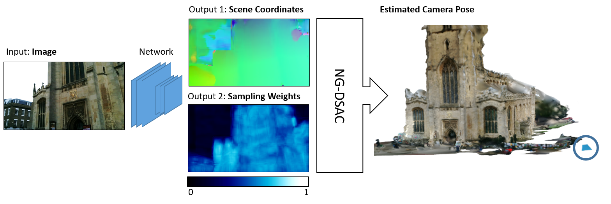

# Neural-Guided, Differentiable RANSAC for Camera Re-Localization

- [Introduction](#introduction)
- [Installation](#installation)
- [Dataset](#dataset)
- [Training NG-DSAC++](#training-ng-dsac)
- [Testing NG-DSAC++](#testing-ng-dsac)
- [Publications](#publications)

## Introduction

NG-DSAC is a general method for fitting parametric models to a set of data points that might contain outliers and noise, i.e. it is a robust estimator. NG-DSAC is a combination of [Neural-Guided RANSAC (NG-RANSAC)](https://arxiv.org/abs/1905.04132) and [Differentiable RANSAC (DSAC)](https://arxiv.org/abs/1611.05705). Due to its differentiability, NG-DSAC allows for training a neural network for estimating parametric models. This code provides an implementation of NG-DSAC for estimating the camera position and orientation from a single RGB image relative to a known environment. 

This code builds upon [Scene Coordinate Regression](https://ieeexplore.ieee.org/document/6619221) and extends our previous re-localization pipeline, [DSAC++](https://github.com/vislearn/LessMore) with neural guidance ("NG-DSAC++").



A network consumes the input image and predicts two outputs: 1) dense scene coordinates that define 2D-3D correspondences between image and scene space and 2) for each scene coordinate a sampling weight used by NG-DSAC to guide the search for the best camera pose with highest inlier count. The output of the pipeline is the camera pose consisting of orientation and position. The pipeline is trained end-to-end, i.e. we minimize a loss defined on the camera pose and propagate gradients all the way back to the network.


For more details, we kindly refer to the [paper](https://arxiv.org/abs/1905.04132). You find a BibTeX reference of the paper at the end of this readme. 

You find additional material, such as pointers to code for estimation of epipolar geometry and horizon lines, on the NG-RANSAC [project page](https://hci.iwr.uni-heidelberg.de/vislearn/research/neural-guided-ransac/).

## Installation

NG-DSAC++ is based on PyTorch, and includes a custom C++ extension which you have to compile and install (but it's easy). The main framework is implemented in Python, including data processing and setting parameters. The C++ extension encapsulates robust pose optimization and the respective gradient calculation for efficiency reasons.

NG-DSAC++ requires the following python packages, and we tested it with the package version in brackets

```
pytorch (1.4.0)
opencv (4.2.0)
scikit-image (0.16.2)
```
You compile and install the C++ extension by executing:

```bash
cd ngdsac
python setup.py install
```
Compilation requires access to OpenCV header files and libraries. If you are using Conda, the setup script will look for the OpenCV package in the current Conda environment. Otherwise (or if that fails), you have to set the OpenCV library directory and include directory yourself by editing the setup.py file.

If compilation succeeds, you can `import ngdsac` in your python scripts. The extension provides two functions: `ngdsac.forward(...)` and `ngdsac.backward(...)`. Check our python scripts or the documentation in `ngdsac/ngdsac.cpp` for reference how to use these functions.

## Dataset

[Cambridge Landmarks](http://mi.eng.cam.ac.uk/projects/relocalisation/#dataset) is an outdoor re-localization dataset. The dataset comes with a set of RGB images of five landmark buildings in the city of Cambridge (UK). The authors provide training/test split information, and a structure-from-motion (SfM) reconstruction containing a 3D point cloud of each building, and reconstructed camera poses for all images.

We provide a Python script to download the dataset and convert it into our format. Execude:
```bash
python setup_cambridge.py
```
The script creates a new folder 'dataset' with one sub-folder for each of the five landmarks. Each landmark folder contains a 'train' and 'test' folder with the following information:

**rgb**: Input images (any format supported by `scikit-image` should work).

**poses**: Text files containing the camera pose **h** as 4x4 matrix. The pose transforms scene coordinates **y** in camera coordinates **e**, i.e. **e** = **hy**.  

**calibration**: Text file containing intrinsic camera paramters. At the moment we only support the camera focal length (one value shared for x- and y-direction, in px). The principal point is assumed to lie in the image center.

**init**: Ground truth scene coordinate maps for initializing the regression network. (3xHxW) tensors (standard PyTorch file format via `torch.save`/`torch.load`) where H and W are the dimension of the *output* of our scene coordinate network. Since we rescale input images to 480px shortest side, and our network predicts an output that is sub-sampled by a factor of 8, our init files are 60px shortest side. We generate scene coordinate ground truth from the sparse SfM point clouds. Pixels without a reconstructed 3D point are set to zero and hence marked invalid. 

*Note: The Cambridge Landmarks dataset contains a sixth scene, *Street*, which we omitted in our experiments due to the poor quality of the SfM reconstruction.*

## Training NG-DSAC++

Like DSAC++, we train NG-DSAC++ in three stages: Two stages for initializing the scene coordinate regression part of the network, and one stage for end-to-end training of the entire pipeline, including learning neural guidance.

*Note: We provide pre-trained networks for all five scenes of the Cambridge Landmarks dataset in the 'models' folder.*

The code contains three separate scripts corresponding to the three training stages. They should be called in sequence if you wish to train from scratch:

```bash
python train_init.py <scene_name> <network_output_file>
```
The first stage minimizes the L1 distance between network output and ground truth scene coordinates in the `dataset/<scene_name>/train/init` folder. Neural guidance will not be trained during this stage. You specify a scene via `<scene_name>` which should correspond to the sub-directory of the `dataset` folder, e.g. 'GreatCourt'. `<network_output_file>` specifies under which file name the script should store the resulting new network.

```bash
python train_repro.py <scene_name> <network_input_file> <network_output_file>
```
The second stage minimizes the reprojection error of the scene coordinate prediction. Neural guidance will not be trained during this stage. You specify a scene via `<scene_name>` which should correspond to the sub-directory of the `dataset` folder, e.g. 'GreatCourt'. `<network_input_file>` points to a network which has already been initialized for this scene, e.g. by the first training stage. `<network_output_file>` specifies under which file name the script should store the resulting new network.

```bash
python train_e2e.py <scene_name> <network_input_file> <network_output_file>
```
The third stage minimizes a loss on the estimated camera pose. It refines scene coordinate regression, and trains neural guidance. You specify a scene via `<scene_name>` which should correspond to the sub-directory of the `dataset` folder, e.g. 'GreatCourt'. `<network_input_file>` points to a network which has already been initialized for this scene, e.g. by the second training stage. `<network_output_file>` specifies under which file name the script should store the resulting new network.

*The `train_e2e.py` script will, by default, train a NG-DSAC++ model, but if you execute it with the `-u` flag, neural guidance will be disabled, and a DSAC++ model will be trained instead.*

You may call all training scripts with the `-h` option to see a listing of all supported command line arguments. The default settings of all parameters correspond to our experiments in the paper. 

Each training script will create a log file `*.txt` file which contains the training iteration and training loss in each line.

## Testing NG-DSAC++

To evaluate on a scene, call:
```bash
python test.py <scene_name> <network_input_file>
```

This will estimate poses for the test set, and compare them to the respective ground truth.  You specify a scene via `<scene_name>` which should correspond to the sub-directory of the `dataset` folder, e.g. 'GreatCourt'. `<network_input_file>` points to a network which has already been initialized for this scene.
Running the script creates two output files:

`test_<scene_name>_.txt` -- Contains the median rotation error (deg), the median translation error (cm), and the average processing time per test image (s).

`poses_<scene_name>_.txt` -- Contains for each test image the corrsponding file name, the estimated pose as 4D quaternion (wxyz) and 3D translation vector (xyz), followed by the rotation error (deg) and translation error (m).

Call the test script with the `-h` option to see a listing of all supported command line arguments. The option `-u` disables neural guidance, e.g. if you want to evaluate a DSAC++ network.

## Publications

Please cite the following paper if you use NG-DSAC or parts of this code in your own work.

```
@inproceedings{brachmann2019ngransac,
  title={{N}eural- {G}uided {RANSAC}: {L}earning Where to Sample Model Hypotheses},
  author={Brachmann, Eric and Rother, Carsten},
  booktitle={ICCV},
  year={2019}
}
```
This code builds on the DSAC++ camera re-localization pipeline:

```
@inproceedings{brachmann2018lessmore,
  title={Learning less is more - {6D} camera localization via {3D} surface regression},
  author={Brachmann, Eric and Rother, Carsten},
  booktitle={CVPR},
  year={2018}
}
```